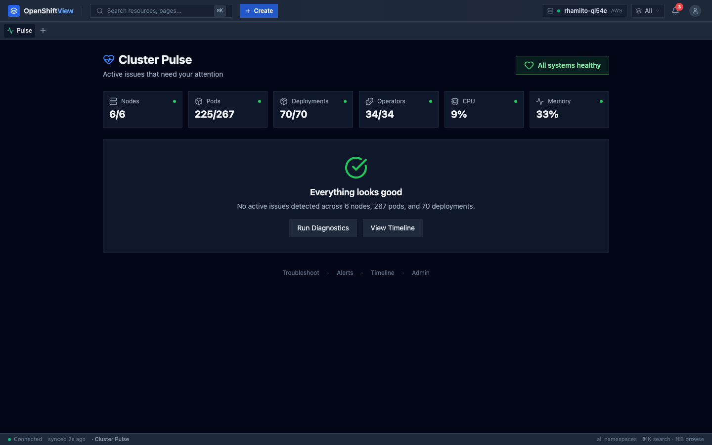
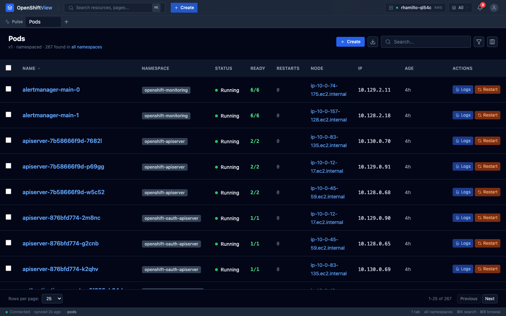
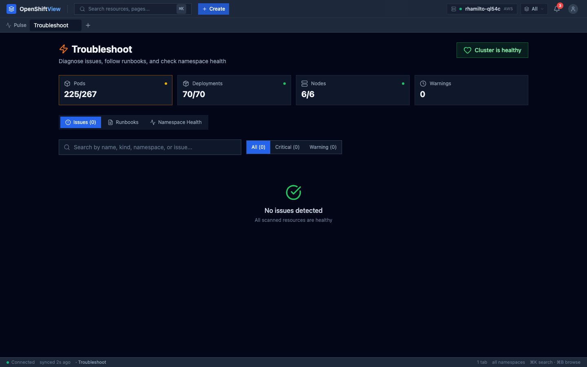
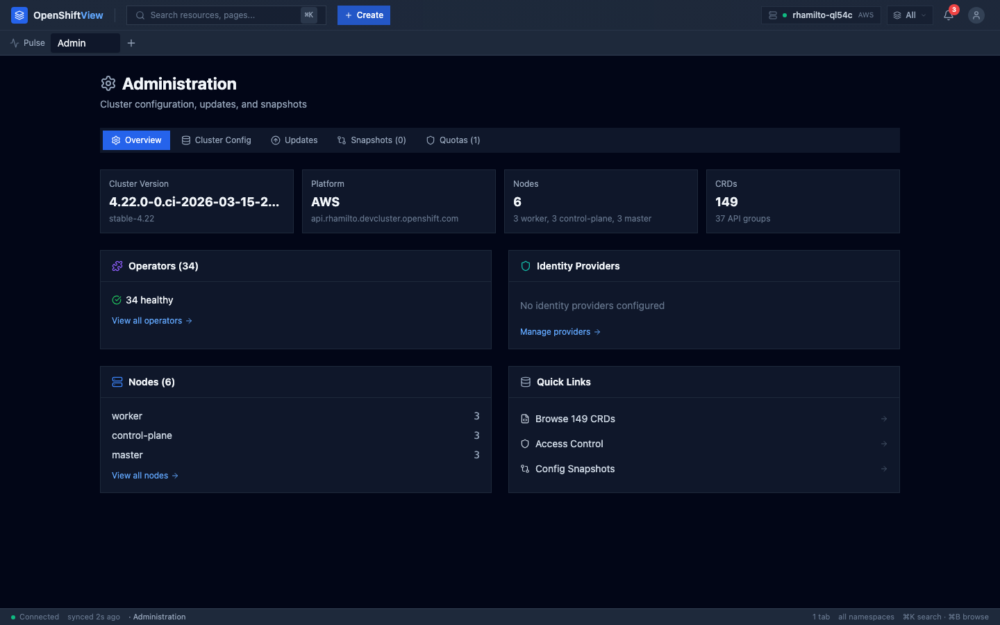
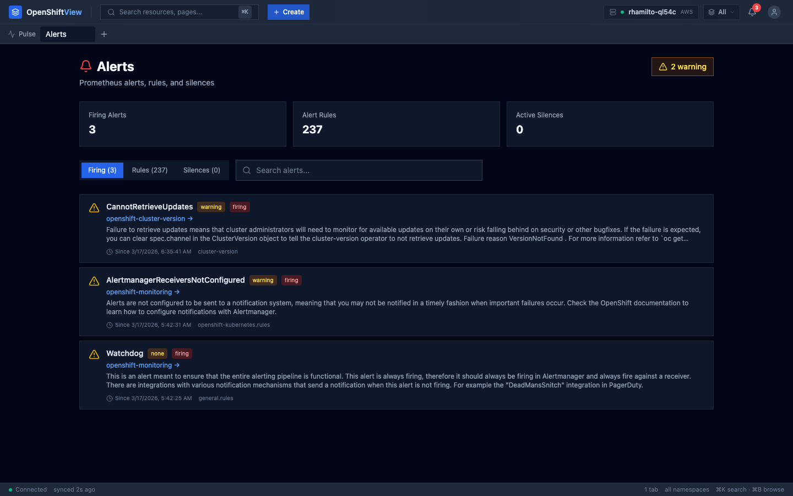
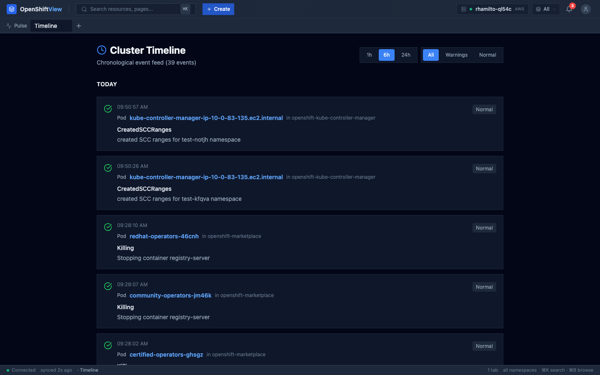
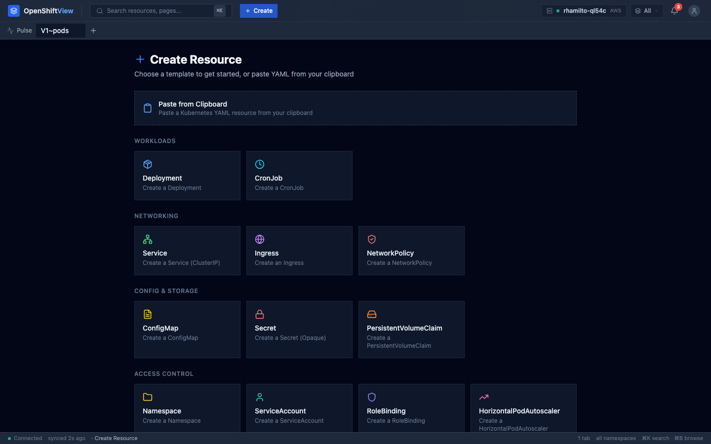

# OpenShiftView

A next-generation OpenShift Console built with React, TypeScript, and real-time Kubernetes APIs. Every view is auto-generated from the API — browse any resource type, see what needs attention, and take action in seconds.



## Features

### Cluster Pulse — Your Landing Page
See only what matters: failing pods, degraded operators, unhealthy deployments, unready nodes, and cluster CPU/memory at a glance. When everything is healthy, it tells you so.

### Auto-Generated Resource Tables
Every resource type in your cluster gets a fully functional table with sortable columns, search, per-column filters, bulk operations, keyboard navigation (j/k/Enter), CSV/JSON export, and a preview panel — all auto-detected from the resource data.



### Interactive Troubleshooting
Auto-diagnose cluster issues with interactive runbooks. Six built-in playbooks cover CrashLoopBackOff, ImagePull errors, pending pods, deployment rollout failures, node issues, and storage problems — each showing affected resources inline with direct action buttons.



### Administration — Config, Updates, Snapshots
Configure OAuth identity providers, proxy settings, image registries, scheduler profiles, TLS security. Initiate cluster upgrades, change update channels, capture and compare config snapshots.



### Prometheus Alerts
View firing alerts with direct links to affected resources, browse alerting rules with copyable PromQL, and manage Alertmanager silences.



### Timeline
Chronological event feed with time range filters and type filtering. Click any event to navigate to the involved resource.



### YAML Editor
Edit resources with syntax highlighting, live validation, diff view, context-aware snippets for 12+ resource types, and OpenAPI schema documentation.



### And More
- **Resource Detail**: Inline actions (scale, restart, terminal, logs, YAML), smart diagnosis, conditions, events
- **Dependency Graph**: Interactive SVG with blast radius analysis
- **Operators**: ClusterOperator health and version tracking
- **Storage**: PVC/PV status, capacity by storage class
- **Access Control**: RBAC overview with cluster-admin audit

## Tech Stack

| Layer | Technology |
|-------|-----------|
| **Framework** | React 19 + TypeScript 5.9 |
| **Bundler** | Rspack 1.7 (Rust-based, ~1s builds) |
| **State** | Zustand (client) + TanStack Query (server) |
| **Styling** | Tailwind CSS 3.4 |
| **Icons** | Lucide React |
| **Editor** | CodeMirror 6 |
| **Routing** | React Router 7 |
| **Testing** | Vitest + jsdom (646 tests) |

## Getting Started

### Prerequisites
- Node.js 24.x or higher
- Access to an OpenShift cluster
- `oc` CLI installed

### Setup

```bash
# Install dependencies
npm install

# Log in to your cluster
oc login --server=https://api.your-cluster.example.com:6443

# Start the API proxy
oc proxy --port=8001 &

# Start the dev server (port 9000)
npm run dev
```

Open [http://localhost:9000](http://localhost:9000) in your browser.

### Scripts

| Command | Description |
|---------|-------------|
| `npm run dev` | Development server with HMR |
| `npm run build` | Production build |
| `npm test` | Run 646 tests |
| `npm run type-check` | TypeScript type checking |

## Architecture

```
src/kubeview/
├── engine/              # Core logic
│   ├── query.ts         # k8sList, k8sGet, k8sPatch, k8sDelete
│   ├── discovery.ts     # API discovery with Promise.allSettled
│   ├── gvr.ts           # GVR URL encoding/decoding
│   ├── watch.ts         # WebSocket watch manager
│   ├── actions.ts       # Resource action registry
│   ├── diagnosis.ts     # Auto-diagnosis rules
│   ├── schema.ts        # OpenAPI schema resolution
│   ├── renderers/       # Auto-column detection, status utils
│   └── enhancers/       # Kind-specific column enhancers
├── views/               # Page components
│   ├── PulseView.tsx    # Landing page — active issues + metrics
│   ├── TableView.tsx    # Universal resource table
│   ├── DetailView.tsx   # Resource detail + actions
│   ├── AdminView.tsx    # Config, updates, snapshots, quotas
│   ├── AlertsView.tsx   # Prometheus alerts + rules + silences
│   └── ...              # Troubleshoot, Timeline, Storage, etc.
├── components/          # Shared UI
│   ├── Shell.tsx        # Layout: CommandBar + TabBar + Dock
│   ├── ClusterConfig.tsx # OAuth, Proxy, Image, Ingress, Scheduler, API Server
│   ├── CommandPalette.tsx
│   ├── ResourceBrowser.tsx
│   └── yaml/            # YAML editor with autocomplete + schema
├── hooks/               # Shared hooks
│   ├── useNavigateTab.ts
│   └── useClusterHealthData.ts
├── store/               # State
│   ├── uiStore.ts       # Tabs, toasts, namespace, dock (persisted)
│   └── clusterStore.ts  # API discovery registry
└── App.tsx              # Routes
```

### Key Patterns

- **Single source of truth**: `K8sResource` type in `renderers/index.tsx`, `ResourceType` in `discovery.ts`
- **Tab deduplication**: All navigation via `useNavigateTab()` — clicking the same resource reuses the existing tab
- **Merge-patch for CRDs**: OpenShift `config.openshift.io` resources use `application/merge-patch+json`, not strategic-merge-patch
- **Error resilience**: All API error handlers have try-catch around JSON parse (handles HTML 502/503 from proxies)
- **Dark theme only**: `slate-*` palette, inline CSS in `index.html` prevents white flash

## Routes

| Route | View |
|-------|------|
| `/welcome` | Welcome / Getting started |
| `/pulse` | Cluster Pulse (landing page) |
| `/troubleshoot` | Troubleshoot with runbooks |
| `/alerts` | Prometheus alerts |
| `/timeline` | Event timeline |
| `/storage` | Storage overview |
| `/access-control` | RBAC overview |
| `/operators` | ClusterOperator health |
| `/admin` | Administration (config, updates, snapshots, quotas) |
| `/r/:gvr` | Resource list (any type) |
| `/r/:gvr/:ns/:name` | Resource detail |
| `/yaml/:gvr/:ns/:name` | YAML editor |
| `/logs/:ns/:name` | Pod logs |
| `/node-logs/:name` | Node logs (audit, journal, CRI-O) |
| `/metrics/:gvr/:ns/:name` | Prometheus metrics |
| `/deps/:gvr/:ns/:name` | Dependency graph |
| `/investigate/:gvr/:ns/:name` | Correlation analysis |
| `/create/:gvr` | Create from YAML template |

## Testing

```bash
# Run all 646 tests
npm test

# Run tests in watch mode
npx vitest

# Run specific test file
npx vitest run src/kubeview/engine/__tests__/actions.test.ts
```

Test coverage spans:
- Engine: query, actions, diagnosis, discovery, renderers, schema, enhancers
- Store: uiStore (tabs, toasts), clusterStore (discovery)
- Components: CommandPalette, ResourceBrowser, Toast, TabBar
- Hooks: useResourceUrl

## Contributing

1. All fixes must include tests
2. No mock data — all data from real K8s APIs
3. No stub toasts — every action makes a real API call
4. Use `slate-*` colors (dark theme only)
5. Use `useNavigateTab()` for navigation (never raw `navigate()`)
6. Use `application/merge-patch+json` for OpenShift CRD patches

## License

MIT
